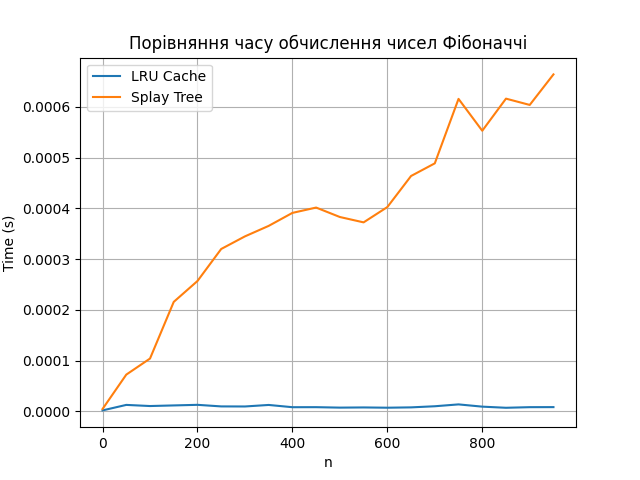
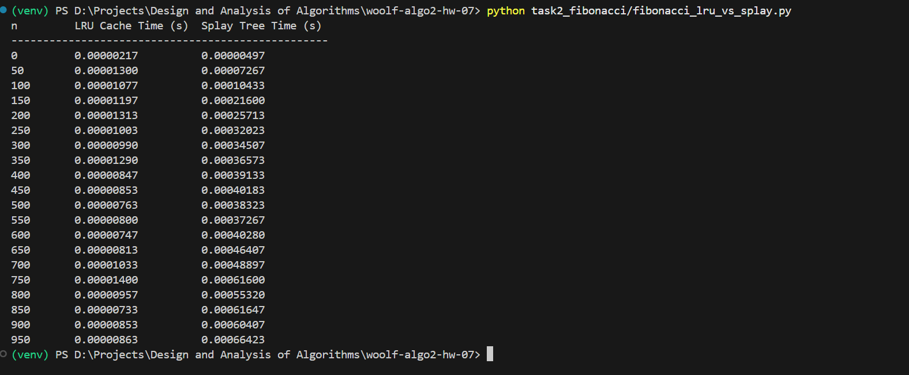

# woolf-algo2-hw-07

> Домашнє завдання з курсу «Design and Analysis of Algorithms» (WOOLF)

## Мета

Опанувати роботу кешів LRU та порівняти ефективність кешування через `@lru_cache` і структуру Splay Tree на прикладі обробки даних і обчислення чисел Фібоначчі.

---

## 📁 Структура проєкту

```
woolf-algo2-hw-07/
├── task1_lru_cache/
│ ├── lru_cache_task.py
│ └── screenshots/
│ └── task1_output.png
│
├── task2_fibonacci/
│ ├── fibonacci_lru_vs_splay.py
│ ├── splay_tree.py
│ └── screenshots/
│ └── task2_fibonacci_comparison.png
│
├── requirements.txt
├── run_all.sh
└── README.md
```

---

### ✅ Завдання 1 — Оптимізація запитів з LRU-кешем

**🔹 Опис:**
- Обробка 50 000 запитів до масиву з 100 000 елементів.
- Реалізовані функції з кешем і без нього.
- Оцінено прискорення.

**🔹 Запуск:**

`python task1_lru_cache/lru_cache_task.py`

### Результат:


## Завдання 2 — Обчислення чисел Фібоначчі (LRU vs Splay Tree)

**🔹 Опис:**

- Обчислення чисел Фібоначчі для n від 0 до 950 з кроком 50.
- Виміряно середній час для двох підходів.
- Побудовано графік та виведено табличку.

**🔹 Запуск:**

`python task2_fibonacci/fibonacci_lru_vs_splay.py`

### Результат:





## Встановлення
`python -m venv venv`
`source venv/bin/activate`       # або `venv\Scripts\activate` (Windows)
`pip install -r requirements.txt`

## Посилання на репозиторій
`https://github.com/vikkrat/woolf-algo2-hw-07`